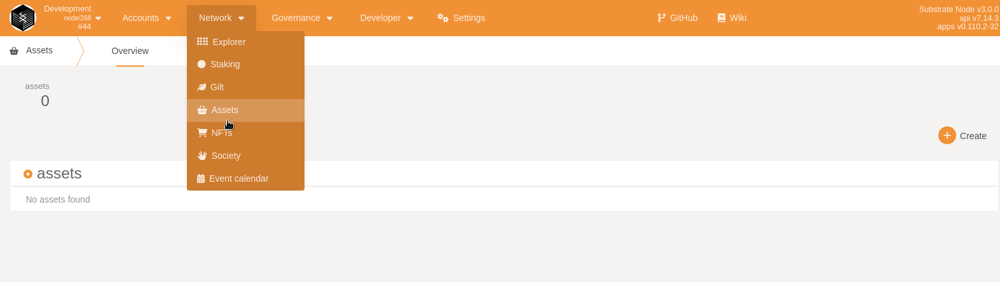
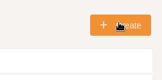
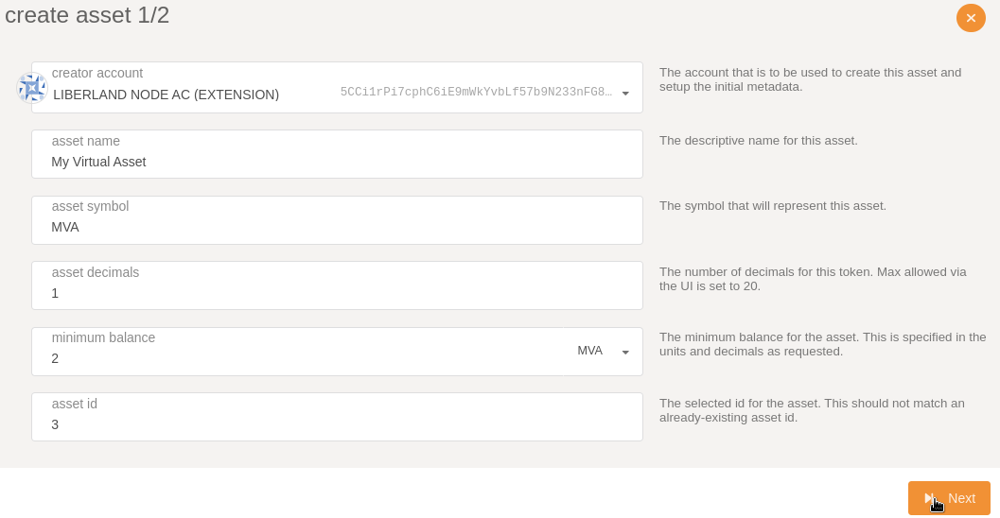
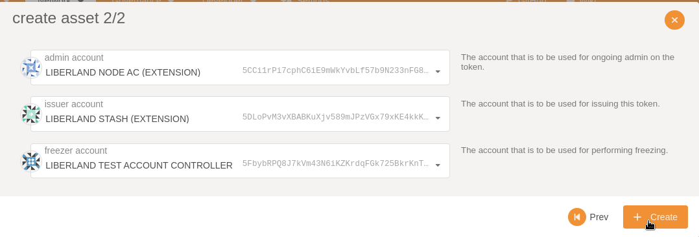
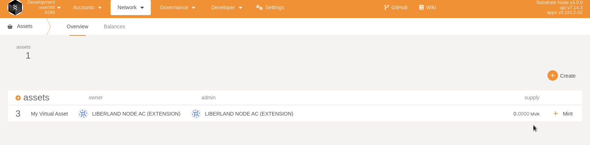
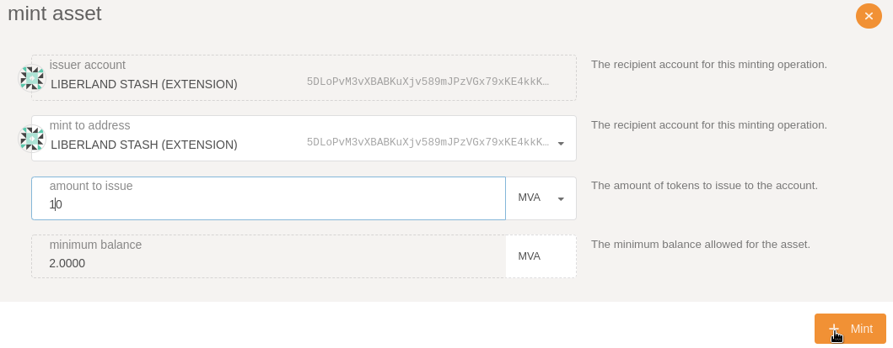
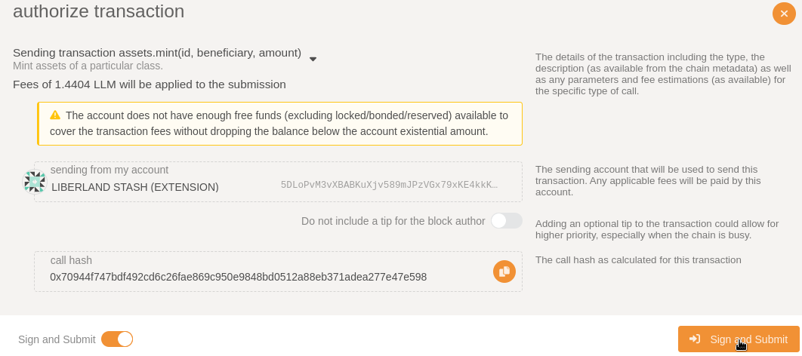
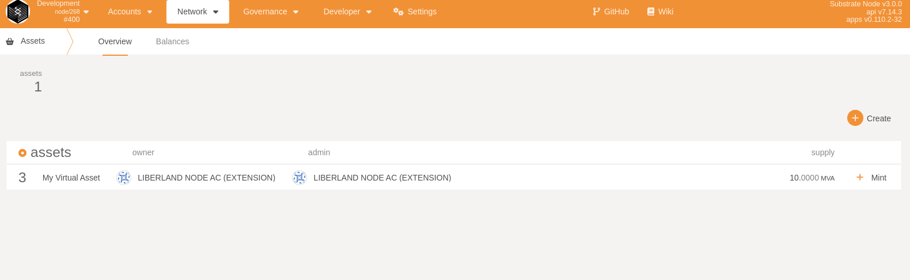

### How to register Assets on Liberland's Menger Network   

Liberland's blockchain supports the substrate asset-pallet.

             
Allowing anyone to:       
* Creating/Minting Assets   
* Asset Transfer      
* Asset Freezing      
* Asset Destruction/Burning

## Step 1:   

Navigate to Liberland blockchain on Polkadot Js and press:   
Network > Asset   
    

## Step 2, Creating Virtual Assets:   
This is a perfect use case for registering on-chains tokenized ownership for real life assets such as: Real estate, Ownership Documents, Precious Metals and more..

Let's go ahead and press the create button:    
 

Here we need to configure our:
* Creator Account | Select what account to be used  
* Asset Name  | Select the name of the asset 
* Asset symbol | Select the shortname for your asset, just like Bitcoin has "BTC"       
* Asset/Amount of decimals(.000)    
* Minimum Balance  
* Asset Id |  This needs to be a unique id that blockchain applications will use to identify, send, transfer, inspect and freeze your asset.   

Keep in mind:   
Asset id's do not normally change when they move from one chain to another so we recommend that you choice a unique number.  

Once that is done, we want to press the Next button.

Now we want to configure who is allowed to Manage our Assets.  
Set the Admin, issuer(Minter) and Freezer Accounts.  

We recommend that you **DO NOT USE** the same account for the freezer, issuer and admin accounts. 

Once we have decided on who will allow to freeze, create and be the admin of the asset. We can go ahead and press create!

Congratulations! The Asset has now been created and the asset can now be used on the liberland network. 
    

After, we have registered an asset on chain we 

## Step 3, Minting Assets:   

Let's mint some assets

Configure the amount of assets you want to put in circulation. 

Authenticate the transaction with your polkadot browser wallet.
    

10 of your assets has been minted.
 
  

You can now Transfer this asset on the liberland network! 
As a developer you can now interact with the asset using multiple modules such as substrate's *[frame_support::traits::tokens::fungible](https://docs.substrate.io/rustdocs/latest/frame_support/traits/tokens/fungible/index.html)*   

### Useful links:  
https://crates.parity.io/pallet_assets/index.html  
https://wiki.polkadot.network/docs/learn-assets   
https://docs.substrate.io/rustdocs/latest/frame_support/traits/tokens/fungible/index.html   