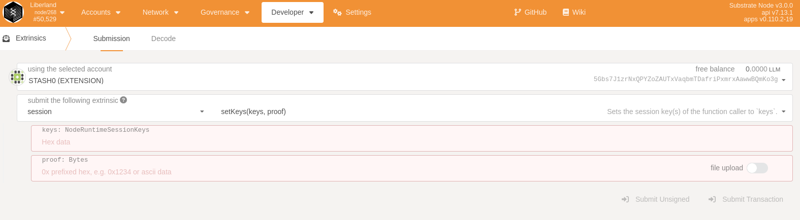
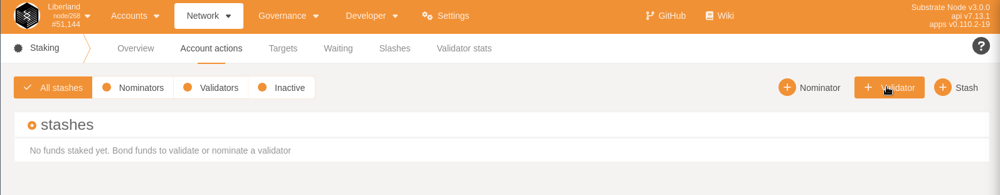

# DEPRECATED GUIDE USE THE LATEST ONE HERE: https://liberland-1.gitbook.io/wiki/v/public-documents/blockchain/for-validators-nominators-and-stakers/run_a_validator_on_hazlitt


## How to run a Validator on Liberland's Menger Testnet


Running a Validator on our testnet is a great way both to support the network and earn an interest rate by running a node. 


## Generic Linux Install:

#### Option 1 (Beginners):
Download a precompiled version of the node and the chainspec:
```shell
$ mkdir liberland_node && cd liberland_node
$ wget http://get.testnet.liberland.org/substrate
$ wget https://github.com/liberland/liberland_substrate/raw/main/liberland-menger.json
```
Once this is done, you can move on to step 3


#### Option 2 (Advanced):
We recommend that you compile your node from scratch in order to 
get a legitimate copy of the binary.

#### 1, Install Rust and Subkey:

```shell
$ curl --proto '=https' --tlsv1.2 -sSf https://sh.rustup.rs | sh
$ cargo install --force subkey --git https://github.com/paritytech/substrate --version 2.0.2 --locked
```


#### 2, Clone and Compile the node:
```shell
$ git clone https://github.com/liberland/liberland_substrate 
$ cd liberland_substrate/
$ rustup update stable
$ rustup update nightly
$ cargo build --release
```


### 4, Run the validator:
Once the node has been compiled, we want to run it!
Change the node key and the validator name
```shell
./target/release/substrate --chain liberland-menger.json \
--validator --in-peers 256 \  
--base-path ~/liberland_chain/ \ 
--name validator_name_here  \
--node-key paste_node_key_here \ 
--bootnodes /ip4/206.221.189.10/tcp/30333/p2p/12D3KooWRm651Kd5GmsLTHJbgX5chQS5npx9ttLgo46UsegCMoNM \
--telemetry-url "ws://telemetry.laissez-faire.trade:8001/submit 1"   
```

If your node as started you should be able to view it on [telemetry.laissez-faire.trade here](http://telemetry.laissez-faire.trade/)


#### Node key

```
$ subkey generate-node-key --file node-key-file
```
I
take the secret key stored in the node key file and *add 0x* in front of it and then it's ready to be used as a parameter by our node.
Example: 
```shell
--node-key 0xPASTE_THE_CONTENT_OF_THE_FILE_HERE

```
 
#### 5, Generate the Session Keys:

#### Automatically:
You can automatically generate and insert new session keys into your node using:
```shell
$ bash scripts/generate_stored_keys.sh
$ bash scripts/ig.sh
```


#### Manual key generation using [subkey](https://docs.substrate.io/v3/tools/subkey/)

Grandpa key:
```shell 
$ subkey generate --scheme ed25519
```

Babe key:
```shell 
$ subkey generate --scheme sr25519
```

im_online key:
```shell 
$ subkey generate --scheme sr25519
```

Authority discovery key:
```shell 
$ subkey generate --scheme sr25519
```

Save the output from subkey in a safe place.

Upload these hot keys to our node:
```shell
curl -H "Content-Type: application/json" -d '{"id":1, "jsonrpc":"2.0", "method": "author_insertKey", "params":["babe", "mnemonic phrase here from Grandpa", "publickeygoesherefrom Grandpa"] }' http://127.0.0.1:9933

curl -H "Content-Type: application/json" -d '{"id":1, "jsonrpc":"2.0", "method": "author_insertKey", "params":["gran", "mnemonic phrase here from babe", "publickeygoeshere from grandpa"] }' http://127.0.0.1:9933

curl -H "Content-Type: application/json" -d '{"id":1, "jsonrpc":"2.0", "method": "author_insertKey", "params":["imol", "mnemonic phrase here from im_online", "publickeygoeshere from imol"] }' http://127.0.0.1:9933

curl -H "Content-Type: application/json" -d '{"id":1, "jsonrpc":"2.0", "method": "author_insertKey", "params":["audi", "mnemonic phrase here from authority discovery", "publickeygoeshere from authority discovery"] }' http://127.0.0.1:9933

```

#### Register the validator:
We want to link our validator to an account by registering our Validator's session keys using Polkadot JS Apps interface(https://polkadot.js.org/apps/?rpc=wss%3A%2F%2Fn2.liberland.network#/explorer) using the output we got from:
```shell
$ curl -H "Content-Type: application/json" -d '{"id":1, "jsonrpc":"2.0", "method": "author_rotateKeys", "params":[]}' http://localhost:9933                          
```


Go to:   
 Polkadot JS Apps -> Developer -> Extrinsics -> session -> setKeys.
  
 
 
 
and paste in the result of the previous curl command.


#### Add validator account
Head over to Network > Staking > Account Actions and add a validator account



Once your node has been added as a validator, your node should become an active Validator in the next Epoch.


### Useful links:    
https://polkadot.js.org/apps/?rpc=wss%3A%2F%2Fn2.liberland.network#/extrinsics            
https://docs.substrate.io/tutorials/v3/permissioned-network/          
https://docs.substrate.io/v3/tools/subkey/           
https://www.youtube.com/watch?v=2lspS7SFJc8         
https://www.youtube.com/watch?v=ejgPSwdLj5o                         
https://wiki.polkadot.network/docs/maintain-guides-how-to-validate-polkadot       
https://core.tetcoin.org/docs/en/tutorials/start-a-private-network/keygen         
