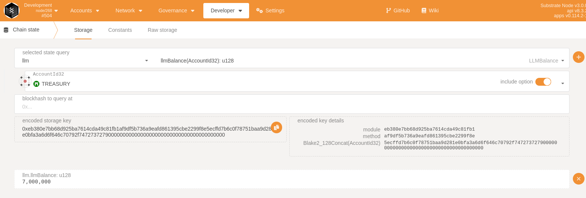
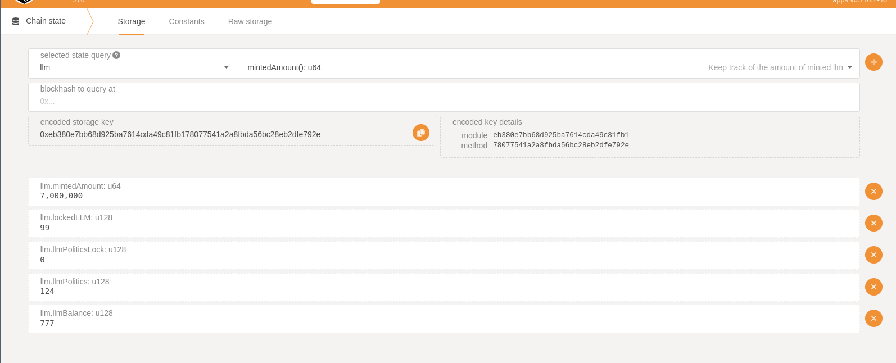

## Liberland Merit(LLM) Pallet


### Current Functionality:   
*  Minting 0.9% of the total supply per year to the treasury
*  Keeping track of Minted amount  
*  Sending and Recieving  
*  Locking in currency
*  [MIT License](https://mit-license.org/)   


### On-chain Pallet functions:   

*  send_llm   
Send LLM to a person

*  lock_llm        
Freeze current LLM, allowing you to vote        

*  unlock_llm         
Unlock the freezed assets       

*  createllm      
Create LLM Asset and premint if the counter is not working           

*  delegated_transfer         
Request a LLM transfer that needs to be approved by the assembly members              


*  approve_transfer          
As an assembly member you can approve a transfer of LLM         


### Storage, balances and keeping track of LLM      
LLM pallet has 5 different storage types:      

##### LLMBalance    
Stores Account and Balances in storagemap, you can query by account  

 





##### MintedAmount    
Keeps track of the amount of current minted(/created) amount of LLM   
This can be queried and will return a number(u64)      

##### lockedLLM   
Current regular frozen llm's  

##### llmPoliticsLock   
Frozen LLM from llmPolitics, when a vote is created some of the llm allocated for politics gets unfreezen  

##### llmPolitics   
LLM that are locked in politics and can only be used by the system to vote 



### The main functionality of llm is:  

##### politics_lock   
Allocate llm for politics(voting and elections)   


##### politics_unlock   
Unlock 10% of your politics balance    


#### unfreeze  
Unfreeze 10% of your frozen llm   


##### treasury_llm_transfer   
The senate can tell the treasury to send LLM to an account  

##### createllm   
manually trigger the creation of llm and the premint   


##### fake_send   
Debug function not used in production  


##### send_llm   
Send LLM to a user  


https://docs.substrate.io/v3/runtime/storage/    


### Debugging: 

run node: 

```shell
$ ./target/release/substrate --dev --unsafe-rpc-external --
```

#### Check amount of minted llm
Polkadot.js apps > Developer > Chainstate > llm > minted amount

  


Treasury address:
5EYCAe5ijiYfyeZ2JJCGq56LmPyNRAKzpG4QkoQkkQNB5e6Z


### rust build info
```shell
$ rustc -vV
rustc 1.60.0 (7737e0b5c 2022-04-04)
binary: rustc
commit-hash: 7737e0b5c4103216d6fd8cf941b7ab9bdbaace7c
commit-date: 2022-04-04
host: x86_64-unknown-linux-gnu
release: 1.60.0
LLVM version: 14.0.0


```


### Approved Multisig llm transfers


