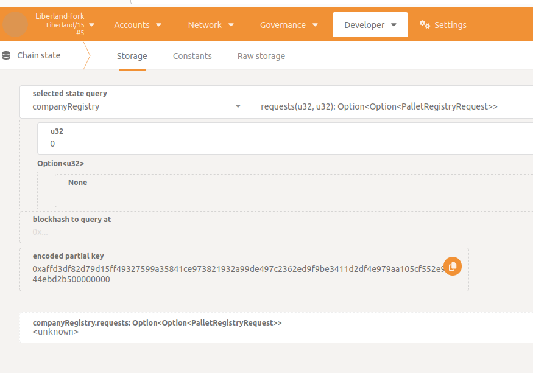

# Fork testing

## Overview


## Requirements:

* node.js + npm
* `apt install -y moreutils jq`

## Testing testnet

1. Check current testnet version.
2. Checkout repository for this version. For example, if testnet has runtime in version `v27.0.0`, checkout tag `v27.0.0`
3. Build binary with embedded testnet runtime: `cargo build --release -F testnet-runtime`:
  * copy it to tmp to make it easier: `cp ./target/release/substrate-node ./substrate/scripts/fork-test/liberland-fork-substrate/tmp/liberland-testnet-v27.0.0`
4. Download runtime you want to test from [GitHub Releases](https://github.com/liberland/liberland_substrate/releases)
  * copy it to tmp to make it easier:  `cp bastiat-v28.0.0.wasm ./liberland-fork-substrate/tmp/bastiat-v28.0.0.wasm`
  * if building runtime yourself,
    * Checkout the branch with the newer version to test (v28 in this example)and build it `cargo build --release -F testnet-runtime`
    * Copy to tmp `cp ./target/release/wbuild/kitchensink-runtime/kitchensink_runtime.compact.compressed.wasm ./substrate/scripts/fork-test/liberland-fork-substrate/tmp/liberland-testnet-v28.0.0.wasm`
Checkout repository for version you want to test. For example, if we're testing runtime `v15.0.0`, checkout tag `v15.0.0`.
5. Make sure you're not running another instance of Liberland Network - port 9944 should be free.
6. Run the forked network:
   ```sh
   cd substrate/scripts/fork-test/
   export BINARY=./tmp/liberland-testnet-v27.0.0
   export RUNTIME=./tmp/liberland-testnet-v28.0.0.wasm
   ./run-fork.sh bastiat.config.sh
   ```
7. Test the chain: https://polkadot.js.org/apps/?rpc=ws://localhost:9944
   * this chain has the same storage as Testnet at the time the test was run - the only differences is that there's only one validator: Alice
   * it should be producing blocks
   * when exploring chain state, you shouldn't see any `<unknown>` values - this suggests some migration is missing

## Testing mainnet

1. Check current mainnet version.
2. Download the binary with the same version as one running currently on mainnet from [GitHub Releases](https://github.com/liberland/liberland_substrate/releases)
   * copy it to tmp to make it easier: `cp linux_x86_build /tmp/liberland-mainnet-v27.0.0`
3. Download runtime you want to test from [GitHub Releases](https://github.com/liberland/liberland_substrate/releases) - it will be a different version than the binary!
   * copy it to tmp to make it easier:  `cp mainnet-v28.0.0.wasm /tmp/mainnet-v28.0.0.wasm`
   * if building runtime yourself,
     * Checkout the branch with the newer version to test (v28 in this example)and build it `cargo build --release -F testnet-runtime`
     * Copy to tmp `cp ./target/release/wbuild/kitchensink-runtime/kitchensink_runtime.compact.compressed.wasm ./substrate/scripts/fork-test/liberland-fork-substrate/tmp/liberland-testnet-v28.0.0.wasm`
4. Checkout repository for version you want to test. For example, if we're testing runtime `v28.0.0`, checkout tag `v28.0.0`.
5. Make sure you're not running another instance of Liberland Network - port 9944 should be free.
6. Run the forked network:
   ```sh
   cd scripts/fork-test/
   export BINARY=/tmp/liberland-mainnet-v27.0.0
   export RUNTIME=/tmp/mainnet-v28.0.0.wasm
   ./run-fork.sh mainnet.config.sh
   ```
7. Test the chain: https://polkadot.js.org/apps/?rpc=ws://localhost:9944
   * this chain has the same storage as mainnet at the time the test was run - the only differences is that there's only one validator: Alice
   * it should be producing blocks
   * when exploring chain state, you shouldn't see any `<unknown>` values - this suggests some migration is missing

## Example error

Below is a screenshot of an error found by fork-testing. It hows that after the runtime upgrade old company request data became unparsable - indicating a missing migration for existing data.


